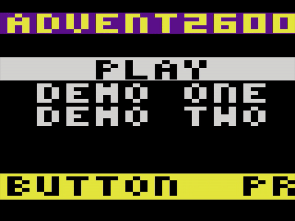

# ADVENT2600
Work In Progress text adventure for the Atari 2600 VCS

First I'd like to state that I'm new to programming the Atari 2600, this is my first
"kernel" and there's a lot of tricks I still have to learn about the system.  While
I was trying to figure out how to render a pirate ship for another game idea, I stumbled
upon this idea for displaying a full screen of text and wondered if I could use it to make
a port of Colossal Cave Adventure for the Atari 2600 from 1977.  In other words, can
you make a workable text display that is good enough to present the classic text
adventure game on the original Atari 2600 hardware in a 4KB cartridge?

OK, in this case, "full screen of text" is eight lines of ten characters, or 80 characters
total.  That's not a whole lot, is it?  But is it enough to make a playable version of the
classic ADVENT?

I don't in any way wish to belittle Warren Robinett's incredible achievement with the
1980 Atari game "Adventure".  I think the choices Mr. Robinett made back then had been the
right ones given the systems limited capabilities.  I still don't know if it's even possible
to put 30+ room descriptions, items and enemies into a 4KB ROM like he managed to do.  As they
say, a picture is worth a thousand words, but a thousand words wouldn't fit into 4KB without
compression.  So even if he could have displayed enough text, utilizing graphics would give you
a richer more enjoyable game.

To me, this is more about "can it be done" than "should it be done".

I have read about the 32 character text display demo and the 36 character demo, both are
really impressive!  However, my understanding is that those demos use pre-generated displays
from ROM and DPC/DPC+/ARM features not found on vanilla (earliest) cartridges.  I was curious
to see if the Atari 2600, without any additional hardware except for a standard 4KB ROM
cartridge, could display a large enough dynamic text screen for a playable version of ADVENT.

## Kernel Features:

- Designed to work on original 2600 hardware with non-bankswitched 4KB ROM cart (like Adventure)
- Eight lines of text with ten characters per line
- Each text line can have different background and foreground colors (nice for text menus)
- Each missile can be positioned on any text line (0 - 7), with any X (0 - 159)
- Font used can have up to 51 3x5 pixel glyphs, enough for uppercase only English text, digits and some symbols
- 80 byte/character text buffer, unchanged between frames to allow for dynamic text displays

## Kernel Limitations:

- Needs ~97 bytes of RAM, brutal given there's only 128 bytes available
- Two copies of the font is required, one normal and one bit reversed, consuming 512 bytes of ROM
- The kernel code is long, currently at 1,285 bytes, making this a challenge for a 2K ROM game
- The font and final display is beyond crude, essentially a 40x48 pixel display

Aside from Colossal Cave Adventure, this kernel may be useful for other games.  For example,
since the display is 10 characters by 8 lines, you could show a full 8x8 game board and use
the 2x8 characters on the side of the display to show previous moves or moves being considered
by the AI.  Might be good for checkers/draughts or chess, or card games like poker or bridge.
Text menus are also really easy with this kernel, of course.

## Big "To Do" Tasks:

- Action/verb input: left / right to change available commands then button to select
- Room description text scrolling: up / down should let the player scroll the description
- Inventory: Probably just a bit within a single byte. Risk: commands change depending
- Real-time text decompression: 6-bit ASCII? Arithmetic/Huffman coding? Risk: scrolling!
- Reduced story: How much ROM left over, can we fit a fun playable adventure in 4KB?
- ~~Setup a github repository for the source~~
- Get real hardware and a cartridge emulator for testing on the real thing

GIF showing how the first room description from Colossal Cave Adventure might look: 

